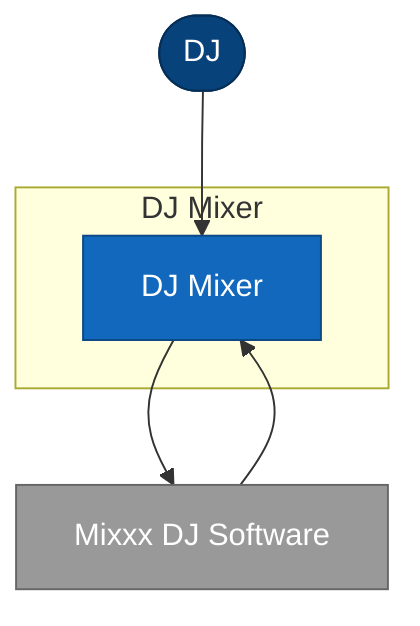

# 3. Context and scope

## 3.1 Business context

A DJ operates DJ Mixer's physical controls to drive Mixxx DJ Software, which performs the
actual audio mixing. DJ Mixer has no other neighbours - it exists solely to give a DJ physical
control over one piece of third-party software.



| External actor / system | Responsibility | Exchange with our system |
| :----------------------- | :-------------- | :------------------------ |
| DJ | Operates the physical hardware controls during a live set | Turns knobs and the fader, presses cue buttons; receives LED feedback |
| Mixxx DJ Software | Runs the actual mixing engine (gain, crossfader, PFL routing) | Bidirectional MIDI over USB |

## 3.2 Technical context

| Peer | Interface | Owner | Direction | Protocol / format | Notes |
| :--- | :-------- | :---- | :-------- | :----------------- | :---- |
| Mixxx DJ Software | Master Gain CC | unknown | bidirectional | MIDI CC (0xB0, CC7) over USB | Knob-to-Mixxx and Mixxx-to-LEDs |
| Mixxx DJ Software | Crossfader CC | unknown | outbound | MIDI CC (0xB0, CC8) over USB | Fader-to-Mixxx only |
| Mixxx DJ Software | Headphone Cue Note | unknown | outbound | MIDI Note (0x90, notes 20/21) over USB | Button-to-Mixxx only |

### 3.2.1 Interface: Master Gain CC

**Purpose:** Lets the DJ set master output volume from a physical knob, and lets Mixxx report
the resulting gain back so the LEDs can display it.
**Direction:** DJ Mixer -> Mixxx (knob turn); Mixxx -> DJ Mixer (LED update). Mixxx is the
source of truth for the actual applied gain.
**Link to spec:** `AppData/Local/Mixxx/controllers/DJMixer.midi.xml`

**Example:**

A MIDI Control Change message, channel 1, controller 7, with a 0-127 value.

```json
[176, 7, 96]
```

**Expectations and exceptions:**

| SLA/SLO | Failure behaviour | Retry / idempotency | Fallback / manual procedure |
| :------ | :----------------- | :-------------------- | :---------------------------- |
| unknown | unknown - no error handling evidenced (STR-U01) | none evidenced | none evidenced |

## Open questions for SME

- [ ] Who owns/maintains the Mixxx-side integration once installed - is this considered supported software, or a personal build with no ownership beyond the DJ (STR-003)?
- [ ] What happens if the USB connection drops mid-set? No failure behaviour is evidenced anywhere (STR-U01).

## Provenance & confidence log

| Claim | Source | Confidence | Evidence |
|---|---|---|---|
| Mixxx DJ Software is the sole external peer | code | high | STR-003 |
| DJ is the sole business actor | code | high | STR-007 |
| Master Gain CC is bidirectional | code | high | STR-004 |
| Crossfader CC is outbound only | code | high | STR-005 |
| Headphone Cue Note is outbound only | code | high | STR-006 |
