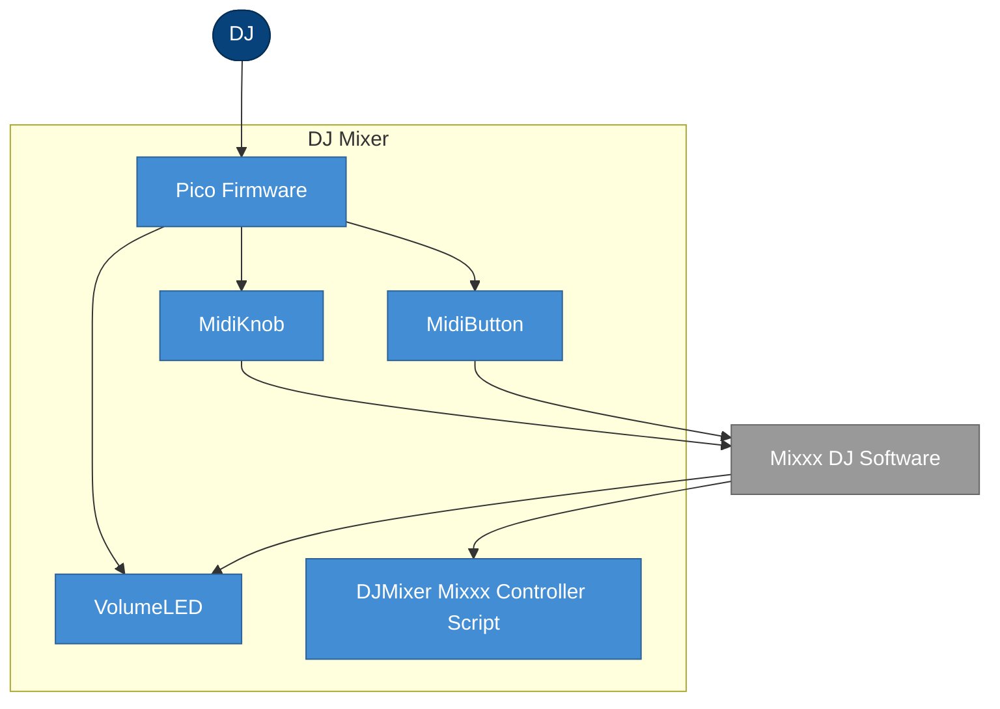

# 5. Building block view

## 5.1 Level 1: White-box overall system

DJ Mixer is decomposed into the units `inventory.json` names as canonical building blocks: one
firmware unit and its three input/output modules running on the Pico, plus one script running
inside Mixxx.

How to read this diagram: boxes are responsibilities and ownership, arrows are dependencies
(not runtime sequence), labels are intent (not necessarily protocol).

### Building blocks (level 1)

| Building block | Responsibility | Depends on | Notes |
| :-------------- | :-------------- | :---------- | :----- |
| Pico Firmware (CircuitPython) | Owns the main polling loop, drives every other block on the device | MidiKnob, MidiButton, VolumeLED | Runs as CircuitPython firmware |
| MidiKnob | Reads an analog potentiometer, emits MIDI CC on change | - | Reused for both the volume knob and the crossfader |
| MidiButton | Reads a pull-up digital button, emits MIDI Note on state change | - | Reused for both headphone cue buttons |
| VolumeLED | Listens for the Master Gain CC and drives 3 LEDs | - | |
| DJMixer (Mixxx Controller Script) | Bridges Mixxx's internal gain engine to an outbound MIDI CC | - | Runs inside Mixxx, not on the Pico |

### External interfaces

| Peer | Interface | Direction | Protocol / format | Where documented |
| :--- | :-------- | :-------- | :------------------ | :------------------ |
| Mixxx DJ Software | Master Gain CC | bidirectional | MIDI CC (0xB0, CC7) | chapter 3.2.1 |
| Mixxx DJ Software | Crossfader CC | outbound | MIDI CC (0xB0, CC8) | chapter 3.2 |
| Mixxx DJ Software | Headphone Cue Note | outbound | MIDI Note (0x90) | chapter 3.2 |

### Internal interfaces

| Between | Interface | Purpose | Notes |
| :------ | :-------- | :------- | :----- |
| Pico Firmware | MidiKnob / MidiButton / VolumeLED | Calls each block's `monitor()` once per loop iteration | In-process method calls, not a message protocol |

## Open questions for SME

- [ ] `structure.json` tags MidiKnob, MidiButton and VolumeLED as `attrs.level: 2` - i.e. internal modules of Pico Firmware - while `inventory.json`'s `canonical_names.building_blocks` lists all five names undifferentiated, which this chapter's own rule ("Level 1 is exactly `inventory.json`'s canonical_names.building_blocks") requires treating as five independent Level 1 blocks. This chapter followed the literal rule; a reader should be aware the two ledgers disagree on granularity, and this may be worth an SME/developer call on which is correct.

## Provenance & confidence log

| Claim | Source | Confidence | Evidence |
|---|---|---|---|
| Five canonical building blocks exist | code | high | INV-001 through INV-005 |
| Pico Firmware depends on MidiKnob, MidiButton, VolumeLED | code | high | STR-001 |
| Level 1/Level 2 granularity is ambiguous between ledgers | inferred | low | STR-001 through STR-005 (attrs.level), INV canonical_names.building_blocks |
