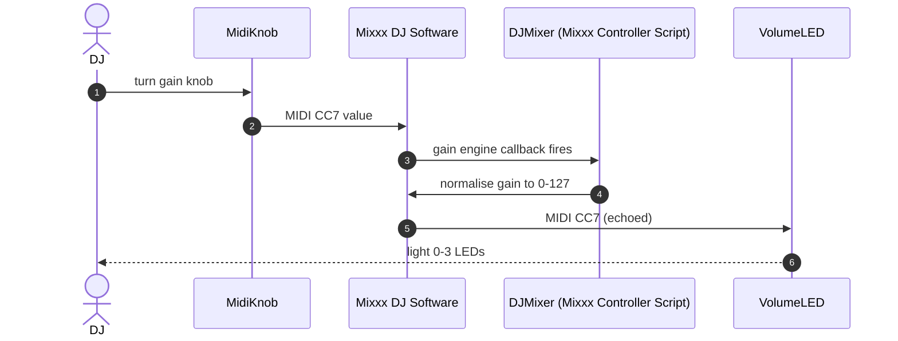
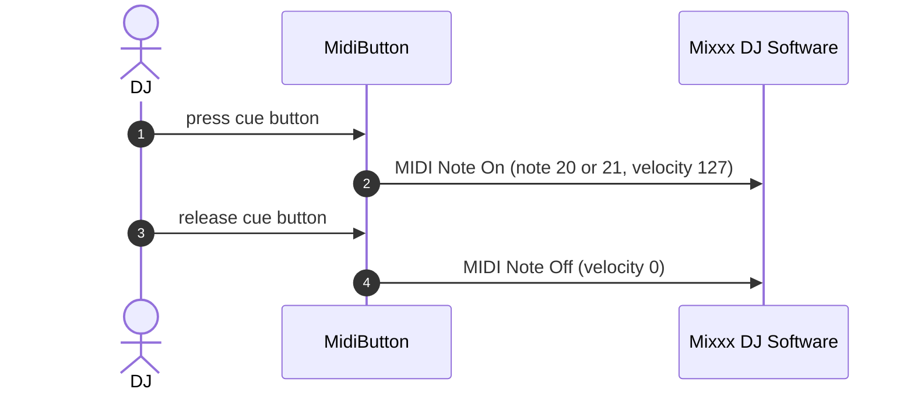

# 6. Runtime view

## 6.1 Scenario: DJ adjusts master volume

The DJ turns the physical gain knob; Mixxx applies the new gain and echoes it back so the
LEDs reflect the current level.

- *Intention:* Change the audible output level and show it on the LEDs.
- *Trigger:* DJ turns the Master Volume Gain knob.
- *Participants:* DJ, MidiKnob, Mixxx DJ Software, DJMixer (Mixxx Controller Script), VolumeLED.

**Exceptions and alternatives:**

- No failure or disconnect handling is implemented anywhere in this flow (STR-U01). If the
  USB link drops mid-turn, the knob's last-known value is simply never sent again once
  reconnected until it changes further - there is no resync.

## 6.2 Scenario: DJ engages headphone cue

The DJ presses a cue button; Mixxx routes that channel to the headphone output.

- *Intention:* Preview a channel privately before mixing it in.
- *Trigger:* DJ presses Headphone Cue Button 1 or 2.
- *Participants:* DJ, MidiButton, Mixxx DJ Software.

**Exceptions and alternatives:**

- No failure or disconnect handling is implemented (STR-U01). A dropped Note Off message
  would leave Mixxx believing the button is still held, with no correction mechanism.

## Open questions for SME

- [ ] Is the lack of any resync/recovery behaviour after a USB disconnect an accepted limitation, or an actual gap worth fixing?

## Provenance & confidence log

| Claim | Source | Confidence | Evidence |
|---|---|---|---|
| Master volume flow sequence | code | high | STR-008 |
| Headphone cue flow sequence | code | high | STR-009 |
| No failure/recovery handling exists | code | high | STR-U01 |
