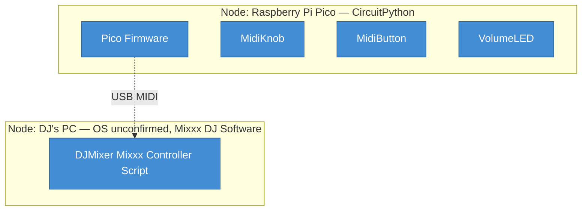

# 7. Deployment view

DJ Mixer spans two physically local nodes with no network deployment: the Raspberry Pi Pico
itself, and whichever PC runs Mixxx. Both are manually provisioned; there is no CI/CD or IaC.

## 7.1 Infrastructure Level 1

### Motivation

Both nodes are physically co-located with the DJ during a set; there is no remote or
networked deployment because nothing here needs one.

### Mapping (what runs where)

| Building block | Runs on | Notes |
| :-------------- | :------- | :----- |
| Pico Firmware (CircuitPython) | Raspberry Pi Pico (device) | |
| MidiKnob | Raspberry Pi Pico (device) | Runs within the Pico Firmware process |
| MidiButton | Raspberry Pi Pico (device) | Runs within the Pico Firmware process |
| VolumeLED | Raspberry Pi Pico (device) | Runs within the Pico Firmware process |
| DJMixer (Mixxx Controller Script) | DJ's PC (Mixxx host) | Loaded from `%LOCALAPPDATA%\Mixxx\controllers` |

### Configuration

| Key / setting | Default | Required | Where set | What it influences |
| :------------- | :------- | :-------- | :--------- | :-------------------- |
| GPIO pin assignments | n/a - hardcoded | yes | main.py source | Which physical pin drives which control |
| MIDI channel / CC / note numbers | none | yes | main.py source, mirrored in DJMixer.midi.xml | Which Mixxx control a given input drives |
| potentiometerSensitivity | 2 | no | MidiKnob.py constructor | Knob responsiveness vs. jitter suppression |
| PuTTY serial connection | COM5 (example), 115200 | no - dev/test only | chosen per-machine, not in source | Ability to interactively test the device |

## Open questions for SME

- [ ] Which OS does the Mixxx host actually require? Only the `%LOCALAPPDATA%` path implies Windows (RUN-U01).
- [ ] `boot.py` is referenced by the setup instructions but was never staged, so its role in the deployment is unconfirmed (RUN-U02).

## Provenance & confidence log

| Claim | Source | Confidence | Evidence |
|---|---|---|---|
| Two deployment nodes: Pico device and DJ's PC | code | high | RUN-001, RUN-002 |
| Every ch05 block is accounted for | inferred | medium | RUN-001, RUN-002, STR-001 |
| Four configuration settings | code | high | RUN-003, RUN-004, RUN-005, RUN-006 |
